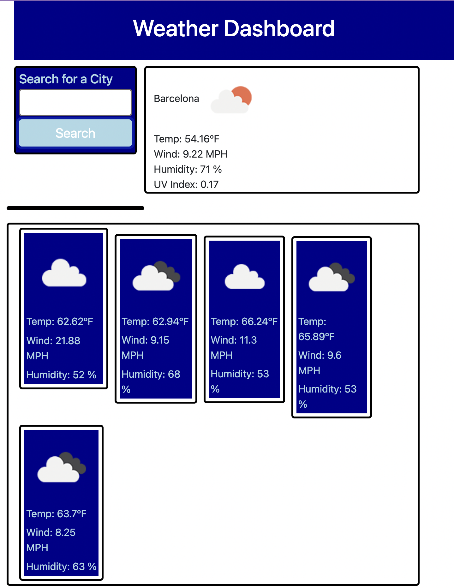

# Weather Dashboard

  
  
    

## An application that provides today's weather and a five day forecast for any city you search for.
-----
## Table of Contents
- [Usage](#usage)
- [License](#license)
- [Contributing](#contributing)
- [Screenshot](#screenshot)
- [Link](#link)
- [Questions](#questions)

## Usage
------
Check out the deployed application at the link below

## License
-------

  [MIT License](https://choosealicense.com/licenses/mit/)
    

    A short and simple permissive license with conditions only requiring preservation of copyright and license notices.
    

## Contributing
------
Reach out on Github or send me an email.

## Screenshot

## Link

[Weather Dashboard](#https://queenamyrodriguez.github.io/AmyR-Weather-dashboard/)

## Questions
-----
You can find me on [Github](https://github.com/queenamyrodriguez) or through the email queenamyrodriguez@gmail.com

